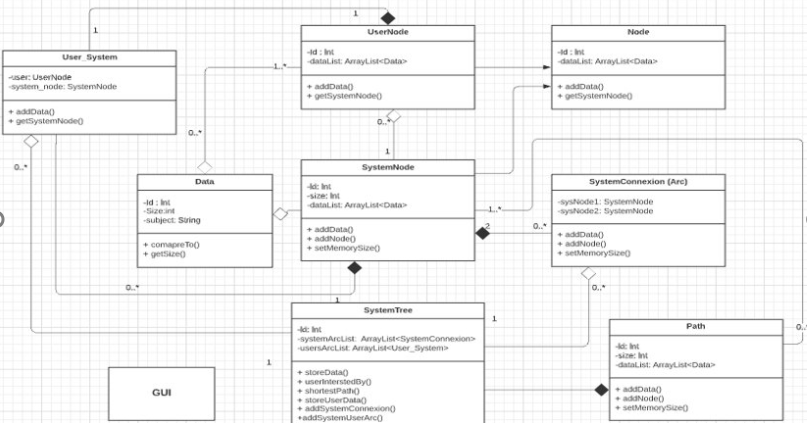

# Personal data storage

Many applications around the world handle “personal data” of varying sizes. A data is said to be personal if it is not accessed only by one user. In order to provide an efficient service, the storage has different system nodes and must place the data on these different nodes.
    
Each system node can receive one or more data depending on of their size. The storage capacity of such a node is its own and can differ according to the nodes. Moreover, a system node can communicate with all other system nodes and some users.
Users are interested in a list of data and can only access that data. They can communicate directly with a single node system and cannot communicate with other users.

Note: In such a context, the communication time between two nodes system or a system node and a user differ according to the users and concerned system nodes. For the sake of simplicity, we will consider that the time communication between two nodes ni, nj is constant, but different from time communication from another couple: neither, nk.

## We will model this using data structures: 
  * Nodes. 
  * Arcs.
  * Trees.

## We used this diagram as an example of our system

## To start coding I made a UML diagram

